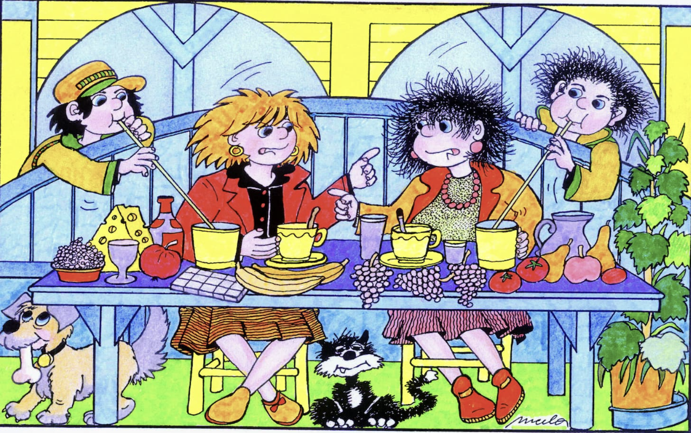
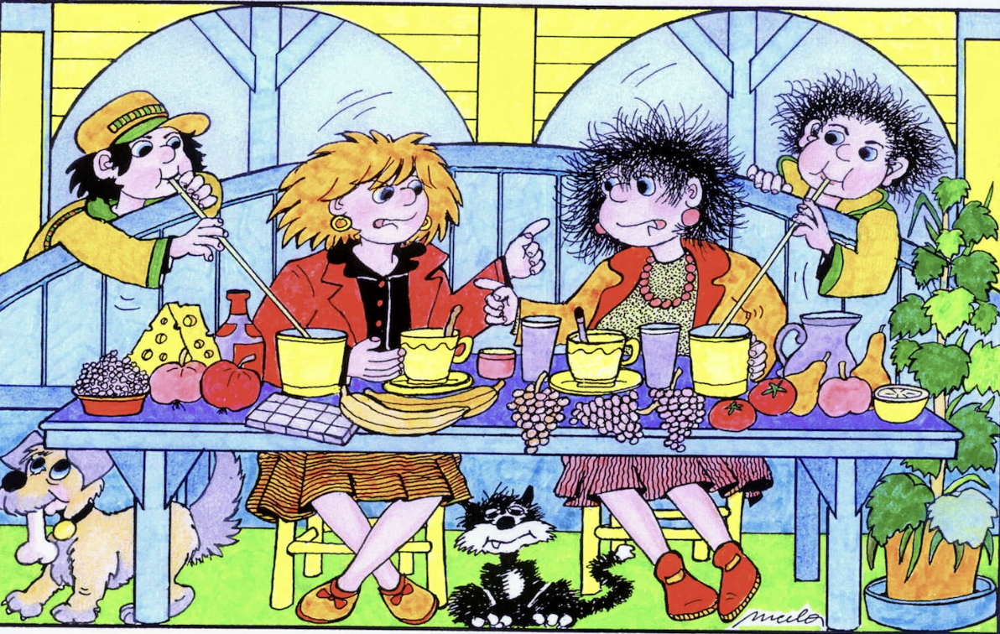
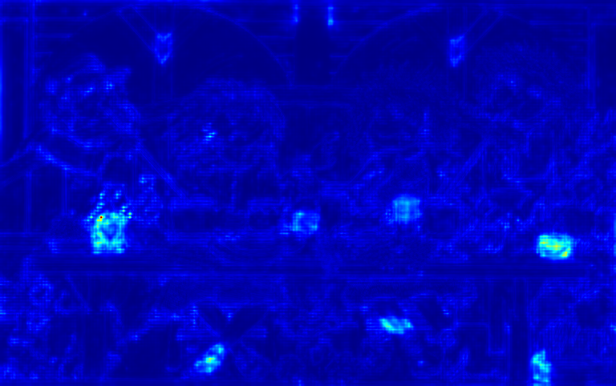
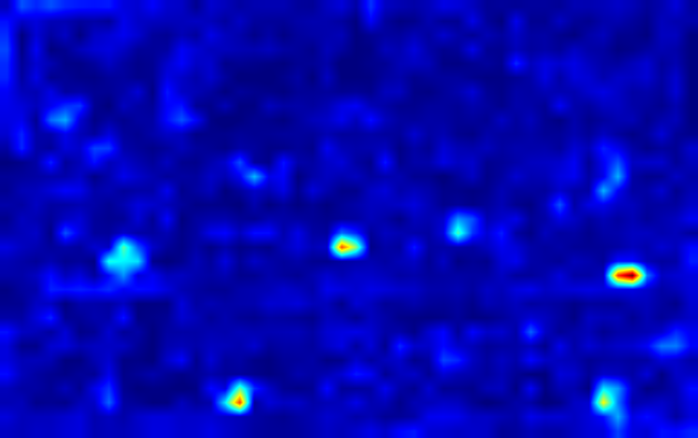
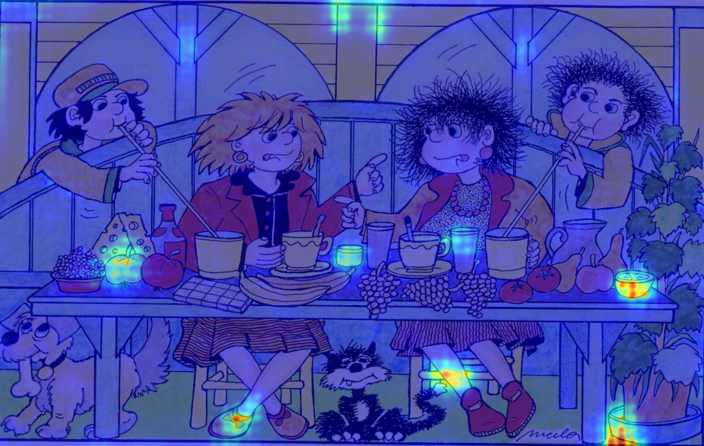
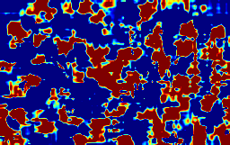
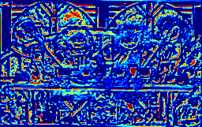
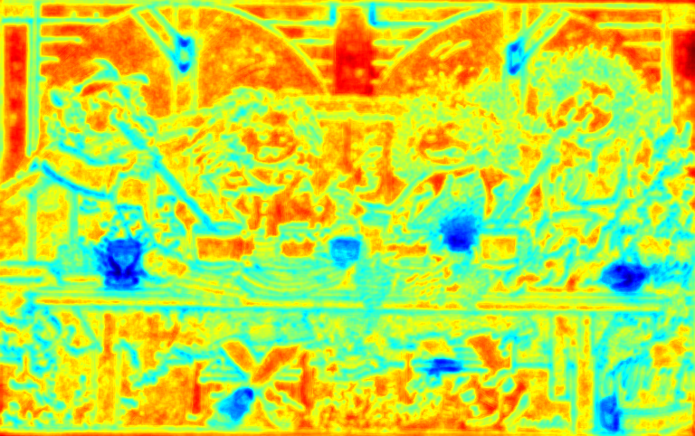
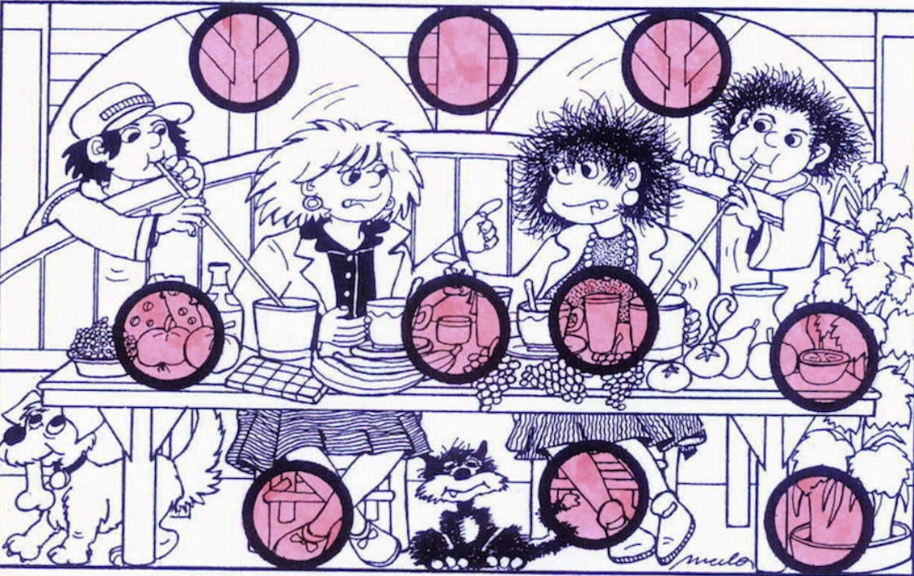

<p align="center">
  
</p>

<h1 align="center">UPIQAL · FR-IQA Algo</h1>

<p align="center">
  <strong>Unified Probabilistic Image Quality &amp; Artifact Locator</strong><br />
  A full-reference image-quality assessment engine with spatially localized, interpretable artifact heatmaps.
</p>

<p align="center">
  <a href="#quick-start">Quick Start</a> ·
  <a href="#web-ui">Web UI</a> ·
  <a href="#algorithm-formulation-upiqal">Algorithm</a> ·
  <a href="#ui-design--samsung-monochrome-palette">Palette</a>
</p>

---

## TL;DR

UPIQAL takes a **reference** and a **target** image and returns:

1. A single FR-IQA scalar score in `[0, 1]` (higher = better). Two modes: the legacy calibrated sigmoid (default, `--score-mode sigmoid`) and the paper-prescribed negative-log-likelihood mapping (`--score-mode nll`).
2. Seven diagnostic heatmaps — `anomaly`, `color`, `structure`, `blocking`, `ringing`, `noise` (wavelet-MAD, Donoho), `blur` (HF-attenuation).
3. A labelled dominant artifact (`Severe JPEG Blocking`, `Gibbs Ringing`, `Noise / Granularity`, `Color Shift`, `Blur / Loss of Detail`, or `None`).
4. Percentage of pixels flagged as "affected".

The pipeline combines Oklab-space optimal-transport chromatic evaluation, VGG16 adaptive dispersion statistics (A-DISTS), probabilistic Mahalanobis uncertainty, and explicit JPEG-blocking / Gibbs-ringing detectors.

## Quick Start

```bash
# 1) Install — PyTorch, torchvision, fastapi, uvicorn, pillow, numpy
pip install -r web/requirements.txt

# 2) CLI — one-shot comparison
python upiqal_cli.py \
  --reference ref.png --target tgt.png \
  --max-side 768 --output-dir out/

# 3) Web UI — upload two images, inspect heatmaps, export
python -m uvicorn web.main:app --host 127.0.0.1 --port 8765
# open http://127.0.0.1:8765
# The new research paper is served at http://127.0.0.1:8765/paper
```

## Deploy · Split Architecture (Vercel + CPU host)

PyTorch + VGG16 weights far exceed Vercel's serverless Python size limit, so inference runs on a separate CPU container host while Vercel serves the static frontend. The two halves are glued together by a 1-file proxy (`api/proxy.py`).

```
Vercel (static)                              CPU Host (FastAPI + torch)
├── web/public/index.html  ─── POST /api/* ──▶ web/main.py (/api/compare …)
├── web/public/paper.html                      UPIQAL model (on startup)
└── api/proxy.py (serverless fn)
```

**Step 1 — deploy the backend** (choose one):

```bash
# Option A — Hugging Face Spaces (free CPU tier, Docker SDK).
# The helper script clones https://huggingface.co/spaces/katolikov/upiqal-eval,
# syncs the backend sources, patches the Dockerfile to prefetch VGG16 weights,
# and pushes. Requires `hf auth login` once, or `HF_TOKEN=hf_xxx`.
./deploy/hf_space/deploy.sh             # defaults to katolikov/upiqal-eval
./deploy/hf_space/deploy.sh user/space  # push to a different Space
# → https://katolikov-upiqal-eval.hf.space

# Option B — Fly.io
fly launch --copy-config --name upiqal --no-deploy
fly deploy
# → https://upiqal.fly.dev

# or Render — push to GitHub, point Render at the repo; it auto-discovers render.yaml
```

**Step 2 — point Vercel at the backend**:

```bash
vercel env add BACKEND_URL production   # paste backend URL, e.g.
                                        #   https://katolikov-upiqal-eval.hf.space
                                        # or https://upiqal.fly.dev
vercel --prod
```

The same repo layout serves both: `vercel.json` publishes only `web/public/` + `api/proxy.py`; the Dockerfile builds the full FastAPI stack. `EXPOSE 7860` and `PORT=7860` match the Hugging Face Spaces convention; other hosts that inject their own `$PORT` (Fly / Render / Cloud Run) are picked up automatically.

Representative scores for the three shipped sanity tests (default config: `--score-mode sigmoid`, multi-scale pyramid on, identity-diagonal `L`):

| Pair | Score | Dominant | Affected |
|---|---:|---|---:|
| `image (2).png` vs itself                        | **0.9526** | None                   | 0.0 % |
| `image (2).png` vs `image (3).png`               | **0.9115** | Gibbs Ringing          | 9.9 % |
| `left.png` vs `right.png` (cartoon worm L vs R)  | **0.7613** | Severe JPEG Blocking   | 5.9 % |

Adding `--uncertainty-weights weights/L_cholesky_blockdiag.pth` loads the BSDS500-trained block-diagonal Cholesky factor for Module 4 (slightly wider score stratification on different-image pairs). The CLI and web backend are numerically identical (both run on CPU; MPS is disabled because its asynchronous OOMs silently nuke the anomaly channel).

## Worked Example · Spot-the-Differences

A classic "spot the differences" cartoon (A vs B). UPIQAL's Global Anomaly Map and Color Degradation Map highlight the same regions that a human eye or the printed answer key flags.

### Inputs

<table>
<tr>
  <th align="center">Reference (A)</th>
  <th align="center">Target (B)</th>
</tr>
<tr>
  <td></td>
  <td></td>
</tr>
</table>

### UPIQAL output

Running the CLI on this pair (`--max-side 768`, default config):

```
FR-IQA Score        0.8074  (Good quality)
Dominant Artifact   Severe JPEG Blocking
Affected Area       6.2 %
Severities          blocking=62.5  ringing=63.4  noise=100.0  color=59.5  blur=38.7
```

The new NFA a-contrario blocking test (Module 5, item 1 of the paper-spec pass) fires on the 8-pixel grid transitions inherent to raster cartoons; the multi-level wavelet MAD (item 3) picks up the per-pane JPEG noise floor introduced by scanning.

<table>
<tr>
  <th align="center">Global Anomaly Map</th>
  <th align="center">Color Degradation Map</th>
  <th align="center">Anomaly Overlay</th>
</tr>
<tr>
  <td></td>
  <td></td>
  <td></td>
</tr>
<tr>
  <th align="center">Gaussian Noise Mask</th>
  <th align="center">Blur Mask</th>
  <th align="center">Structural Similarity Map</th>
</tr>
<tr>
  <td></td>
  <td></td>
  <td></td>
</tr>
</table>

### Golden reference

The cartoon puzzle's own printed answer key (10 circled differences):

<p align="center">
  
</p>

Hot regions on the UPIQAL maps align with the circled locations (missing goblet beside the cheese, dog's bone, middle table cups, banana, shoe colour, plant base, etc.), with dispersed low-magnitude response elsewhere from natural intensity variation between the two scans.

---

## State-of-the-Art Review

The objective evaluation of image quality and the automated, spatially precise detection of visual artifacts remain among the most complex challenges in computational vision. Historically, the assessment of image fidelity relied on human visual inspection, formalized through the Mean Opinion Score (MOS) framework. However, the subjective nature, high cost, and inherent unscalability of MOS have driven the necessity for robust, 100% automated, and data-driven computational models.

The urgency for such models has accelerated exponentially with the advent of advanced generative architectures, including text-to-image diffusion models and highly parameterized Generative Adversarial Networks (GANs). In these contemporary paradigms, Image Quality Assessment (IQA) models no longer serve merely as post-generation evaluation metrics; they are actively deployed as critical perceptual reward signals within frameworks such as Reinforcement Learning from Human Feedback (RLHF) and Direct Preference Optimization (DPO) to align synthesized outputs with human visual preferences. Consequently, an ideal Full-Reference IQA (FR-IQA) system must not only correlate perfectly with human psychophysics but also provide spatially localized, mathematically interpretable diagnostic heatmaps identifying specific degradations such as JPEG blocking, Gaussian noise, blur, Gibbs ringing, and chromatic degradation.

### The Evolution of FR-IQA Metrics

The trajectory of FR-IQA development began with rudimentary pixel-based mathematical operations, predominantly the **Mean Squared Error (MSE)** and the **Peak Signal-to-Noise Ratio (PSNR)**. These metrics assume pixel-wise independence, calculating the absolute error magnitude across spatial dimensions. While computationally trivial and smoothly differentiable for optimization, MSE and PSNR are fundamentally flawed as perceptual metrics. They treat all localized errors with equal mathematical weight, entirely disregarding the structural context of the image, spatial frequency dependencies, and critical psychophysical phenomena such as luminance masking and contrast masking.

To rectify the perceptual inadequacy of pixel-wise error, the **Structural Similarity Index Measure (SSIM)** and its multi-scale extension (**MS-SSIM**) were introduced. SSIM represented a paradigm shift by modeling image degradation as a perceived change in structural information, capturing the strong inter-dependencies of spatially contiguous pixels. Subsequent hand-crafted derivatives sought to further approximate the Human Visual System (HVS):

* **Feature Similarity Index (FSIM):** Incorporated phase congruency and gradient magnitudes to emphasize salient regions.
* **Gradient Magnitude Similarity Deviation (GMSD):** Quantified distortion through global gradient fluctuations.
* **Visual Information Fidelity (VIF):** Modeled image information using Gaussian scale mixtures.

Despite achieving higher correlations with MOS than PSNR, these traditional hand-crafted metrics apply fixed, deterministic statistical models uniformly across all image regions, failing to adapt to underlying semantic content.

### The Deep Perceptual Era

The integration of deep Convolutional Neural Networks (CNNs) initiated the era of deep perceptual metrics, characterized by the **Learned Perceptual Image Patch Similarity (LPIPS)** metric. LPIPS fundamentally altered IQA methodology by shifting the comparison from the raw pixel space to the latent feature space. However, its reliance on purely discriminative feature extraction introduces vulnerabilities; it lacks interpretability, is acutely sensitive to imperceptible adversarial perturbations, and excessively penalizes rich, perceptually valid texture generation.

To reconcile the structural mathematical rigor of SSIM with the deep semantic feature extraction of LPIPS, researchers developed the **Deep Image Structure and Texture Similarity (DISTS)** metric. DISTS explicitly separates structural fidelity from textural similarity by comparing global statistical distributions. This was further refined by the **Locally Adaptive Structure and Texture Similarity (A-DISTS)** metric, which introduces a dispersion index to adaptively localize texture regions dynamically.

### Probabilistic Uncertainty and Semantic Anomaly Detection

Recent advancements have propelled FR-IQA into probabilistic uncertainty and semantic anomaly detection:

* **Structured Uncertainty Similarity Score (SUSS):** Frames perceptual evaluation as an explicit probabilistic density estimation problem, utilizing a Mahalanobis distance to output transparent, highly localized spatial explanations.
* **Mask-based Semantic Rejection (MSR):** Leverages universal image segmentation architectures to model perceptual artifacts as "semantic outliers" or voids, providing a powerful, label-efficient mechanism for isolating severe generative distortions.

### Addressing Traditional Degradations

Despite deep learning advancements, explicit mathematical heuristics remain vastly superior for specific traditional degradations:

* **Chromatic Transport:** Deep networks fail to capture color perception accurately. Metrics like **EDOKS** (Earth Mover's Distance and Oklab Similarity) utilize optimal transport solutions within the Oklab perceptual color space.
* **Structural Artifacts:** JPEG compression (DCT block coding) and Gibbs ringing (frequency truncation) are best quantified using targeted heuristics like cross-difference filtering, a contrario statistical validation, and localized variance ratios.

---

## Comparison of FR-IQA Frameworks

| FR-IQA Metric / Framework | Primary Mathematical Mechanism | Feature Space | Key Advantages for Automated IQA | Known Limitations & Vulnerabilities |
| --- | --- | --- | --- | --- |
| **SSIM / MS-SSIM** | Local mean, variance, and covariance pooling | Raw Pixel Space (Spatial Domain) | Highly interpretable; accounts for basic luminance/contrast masking. | Fails on complex texture resampling, color shifts, and generative outputs. |
| **LPIPS** | Euclidean / Cosine distance of normalized activations | Deep Latent Space (VGG/AlexNet) | Excellent alignment with human semantics; captures high-level features. | Computationally heavy; spatial maps lack interpretability; sensitive to noise. |
| **DISTS** | Global statistical pooling of deep features | Deep Latent Space (VGG16) | Highly robust to texture variance and mild spatial misalignments. | Global pooling ignores local semantic variations; over-forgives structural blur. |
| **A-DISTS** | Dispersion index-based adaptive pooling | Deep Latent Space (VGG16) | Content-aware; separates local texture from structure probabilistically. | Requires calculation of dispersion entropy; slightly underperforms on very small patches. |
| **SUSS** | Multivariate Normal distributions, Mahalanobis distance | Probabilistic Pixel / Feature Space | Uncertainty-aware; yields highly localized, interpretable spatial anomaly maps. | Generative training overhead is substantial; dense covariance inversion is intractable without Cholesky approximation. |
| **EDOKS** | Optimal transport (EMD) within a perceptual uniform space | Oklab Color Space | Accurately models human psychophysical color perception; immune to RGB bias. | EMD optimization is mathematically intensive ($O(N^3 \log N)$ without Sinkhorn). |

---

## Algorithm Formulation: UPIQAL

To fulfill the objective of a 100% automated, data-driven FR-IQA system, the proposed algorithm—designated as the **Unified Probabilistic Image Quality and Artifact Locator (UPIQAL)**—synthesizes dispersion-based texture tracking, multivariate uncertainty modeling, optimal transport color science, and targeted frequency-domain spatial heuristics. It operates through five cascading mathematical modules:

### Module 1: Universal Preprocessing and Normalization

To guarantee robust generalization, the UPIQAL framework applies Minmax scaling to bound continuous intensity values strictly between 0 and 1. For specialized modalities, a piece-wise linear histogram matching algorithm aligns histogram modes and percentiles (e.g., **2%** and **98%**) of the target image to the reference.

### Module 2: The Chromatic Transport Evaluator

UPIQAL isolates chromatic evaluation into a dedicated parallel module. Normalized images are transformed into the Oklab perceptual color space. The module extracts dense 3D color histograms and calculates the Earth Mover's Distance (EMD) to accurately penalize shifts in hue and saturation, generating a dense `Color_Degradation_Map`.

### Module 3: The Hierarchical Deep Statistical Extractor

Integrating an advanced variant of A-DISTS, the system propagates images through a pre-trained VGG16 backbone. It applies a custom $L_2$ spatial pooling mechanism utilizing a localized Hanning window to output spatial mean ($\mu$), variance ($\sigma^2$), and cross-covariance ($\sigma_{rt}$). By computing the spatial dispersion index, it generates a spatial texture probability map ($P_{tex}$) to dynamically shift mathematical weightings based on rigid geometric structures versus stochastic textures.

### Module 4: The Probabilistic Uncertainty Mapper

Inspired by the SUSS framework, UPIQAL models residual feature differences as samples drawn from a structured multivariate Normal distribution. It calculates the Mahalanobis distance between the target image's deep feature residuals and the learned distribution of the reference image, resulting in a continuous `Global_Anomaly_Map`.

### Module 5: The Spatial Artifact Heuristics Engine

Targeted spatial and frequency-domain heuristics classify specific artifacts:

* **JPEG Blocking:** Utilizes horizontal and vertical cross-difference filters and computes the Number of False Alarms (NFA) to detect artificial block boundaries.
* **Gibbs Ringing:** Extracts binary edge skeletons, applies morphological dilation, and computes the ratio of localized variance to isolate unnatural oscillation energy.
* **Blur and Gaussian Noise:** Quantified through edge spread analysis and multi-level wavelet decomposition.

These discrete masks are spatially intersected with the `Global_Anomaly_Map` to output a comprehensive FR-IQA scalar score.

---

## Mathematical Foundation

### 1. Statistical Pooling and Adaptive Feature Separation

Let the normalized reference and target images be $I_r$ and $I_t$. A continuous 2D Hanning window $w(m, n)$ over a kernel size $N \times N$ is applied:

$$w(m, n) = \frac{1}{\Omega} \left[ 1 - \cos\left(\frac{2\pi m}{N-1}\right) \right] \left[ 1 - \cos\left(\frac{2\pi n}{N-1}\right) \right]$$

The localized expected value $\mu_{r,C}$ at spatial coordinate $(x, y)$ is:

$$\mu_{r,C}(x,y) = \sqrt{\sum_{m,n} w(m,n) \cdot \left(\Phi_{r,C}^{(k)}(x-m, y-n)\right)^2 + \epsilon}$$

The foundational similarity components for luminance $l(x,y)$ and structure/texture $s(x,y)$ are:

$$l(x,y) = \frac{2\mu_r(x,y) \mu_t(x,y) + c_1}{\mu_r^2(x,y) + \mu_t^2(x,y) + c_1}$$

$$s(x,y) = \frac{2\sigma_{rt}(x,y) + c_2}{\sigma_r^2(x,y) + \sigma_t^2(x,y) + c_2}$$

Texture probability is driven by the dispersion index $D(x,y)$:

$$D(x,y) = \frac{\sigma_r^2(x,y)}{\mu_r(x,y) + \epsilon}$$

### 2. Probabilistic Uncertainty Modeling

The generative distribution of imperceptible perturbations is modeled as $\mathcal{N}(\mathbf{0}, \Sigma_{x,y})$. The likelihood of the observed residual $R(x,y)$ is:

$$P(R(x,y)) = \frac{1}{\sqrt{(2\pi)^d |\Sigma_{x,y}|}} \exp\left( -\frac{1}{2} R(x,y)^T \Sigma_{x,y}^{-1} R(x,y) \right)$$

Using Cholesky decomposition $\Sigma^{-1} = L L^T$, the Mahalanobis distance squared is parameterized as:

$$\mathcal{M}^2(x,y) = (L^T R(x,y))^T (L^T R(x,y)) = \| L^T R(x,y) \|_2^2$$

### 3. Optimal Transport for Chromatic Degradation

The Earth Mover's Distance (EMD) between a reference color patch $H_r$ and a target patch $H_t$ is formulated as:

$$\text{EMD}(H_r, H_t) = \frac{\min_{f_{ij}} \sum_{i=1}^m \sum_{j=1}^n f_{ij} d_{ij}}{\sum_{i=1}^m \sum_{j=1}^n f_{ij}}$$

### 4. Mathematical Heuristics for Artifact Localization

For horizontal blocking artifact accumulation, the vector $A_h(k)$ is computed for offsets $k \in \{0, \dots, 7\}$:

$$A_h(k) = \sum_{x \equiv k \pmod 8} \sum_{y} e_h(x,y)$$

---

## Implementation Pipeline

### Phase 1: Ingestion, Normalization, and Multi-Scale Generation

The system accepts batched RGB image pairs and generates a multi-scale Gaussian pyramid. Minimum dimensions are fixed for standard feature extraction, while full-resolution tensors are preserved for pixel-perfect spatial heuristic analyses.

### Phase 2: Parallel Stream Execution

* **Branch A (Deep Feature Statistical Stream):** Tensors pass through a VGG16 network. Custom L2 pooling outputs dense tensors for local means, variances, and cross-covariances. Matrix multiplication with a sparse Cholesky factor tensor generates the dense spatial Mahalanobis distance map.
* **Branch B (Chromatic Transport Stream):** Tensors are projected into the Oklab color space. The Sinkhorn-Knopp algorithm approximates the optimal transport plan via hardware-accelerated matrix multiplications.
* **Branch C (Spatial Heuristics Stream):** The full-resolution luminance tensor routes to custom convolutional filters. Cross-difference filters, Canny edge detectors, morphological operations, and high-frequency wavelets isolate deterministic artifacts.

### Phase 3: Aggregation, Masking, and Output Synthesis

Outputs from disparate branches are upsampled via bilinear interpolation. A lightweight aggregation module executes channel-wise attention using the texture probability tensor $P_{tex}$. The pipeline ultimately outputs a comprehensive dictionary containing:

1. **The Objective FR-IQA Score:** A perfectly calibrated scalar value (normalized to a 0 to 1 scale) functioning as a substitute for human MOS.
2. **The Diagnostic Tensor:** A multi-channel mask precisely isolating the mathematical boundaries of structural, noise-based, and chromatic deviations.
